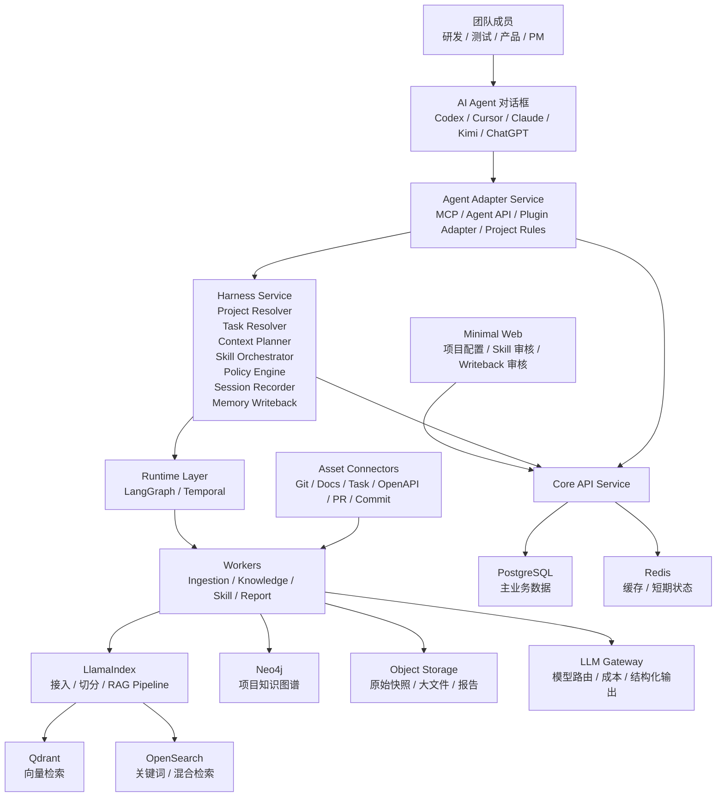
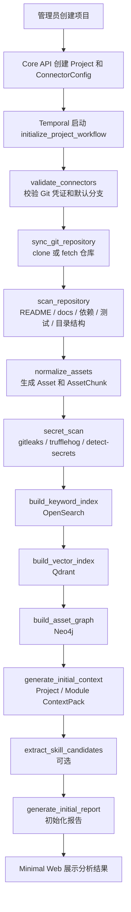
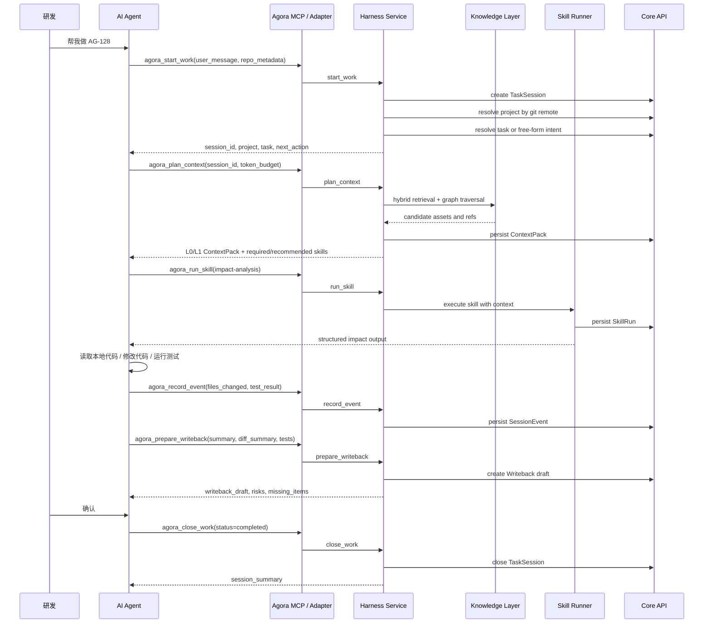
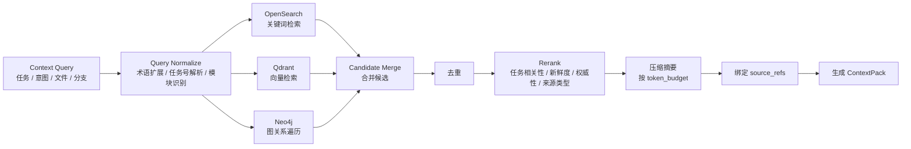
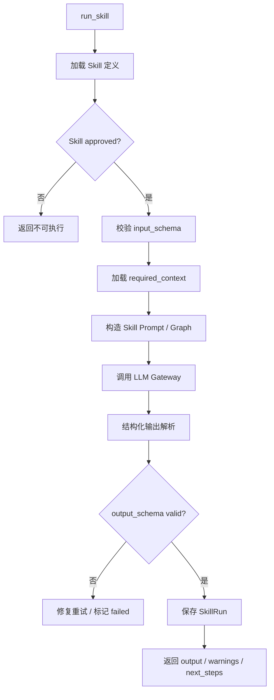
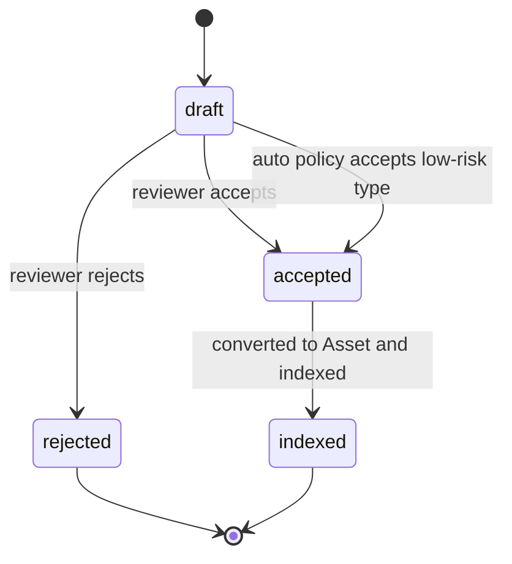
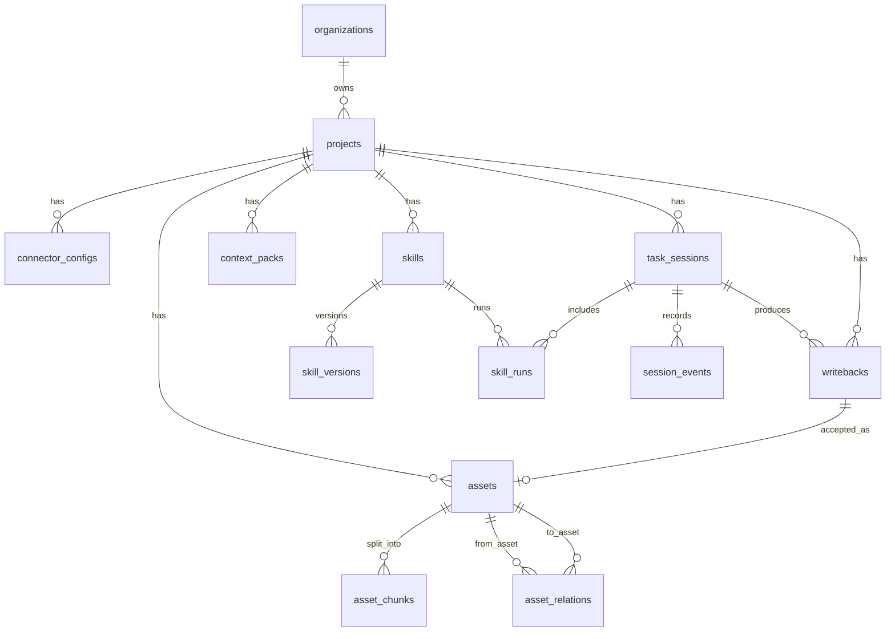
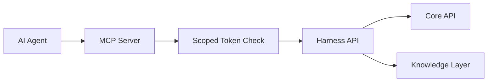
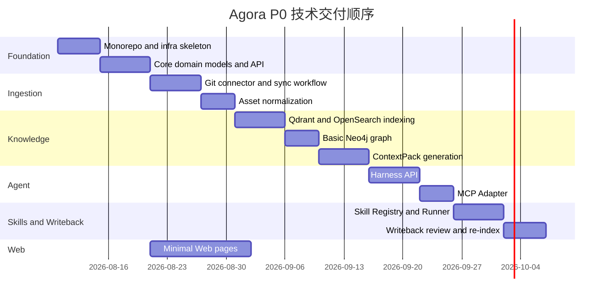

# Agora 团队级 AI 项目 Harness 详细设计

## 1. 文档目的

本文是 Agora 总体设计的详细技术设计文档，目标是把“Team AI Project Harness”从产品概念拆成可实施的系统设计。

本文覆盖：

- 系统组件和服务边界。
- 项目初始化技术流程。
- Agent 与 Harness 的调用协议。
- ContextPack 生成细节。
- Skill Registry / Skill Runner 实现细节。
- Writeback 和知识沉淀流程。
- 核心数据表。
- 后台工作流。
- MCP 工具设计。
- Minimal Web 技术页面。
- 部署和可观测性。

本文不进入具体代码实现计划。代码任务拆分将在 implementation plan 中完成。

## 2. 核心结论

Agora 的技术核心是 Harness Service，而不是 Web、MCP 或知识库本身。

```text
AI Agent 只调用 Agora Harness 暴露的任务级能力。
Harness 决定如何检索、压缩、编排 Skill、记录过程和回写知识。
底层 RAG、搜索、图谱和工作流系统使用成熟组件。
```

## 3. 总体技术架构



## 4. 服务边界

### 4.1 Agent Adapter Service

职责：

- 对外暴露 MCP Server。
- 对外暴露 Agent API。
- 生成不同 Agent 的 Project Rules / Instructions。
- 接收 Agent 请求并转发到 Harness。
- 做 Agent scoped token 校验。
- 记录基础调用日志。

不负责：

- 不直接检索 Qdrant / OpenSearch / Neo4j。
- 不实现 ContextPack 策略。
- 不执行 Skill。
- 不写业务数据表。

### 4.2 Harness Service

职责：

- 识别当前项目。
- 识别当前任务或 free-form intent。
- 创建和更新 TaskSession。
- 规划上下文。
- 编排 Skill。
- 执行 policy。
- 生成 Writeback draft。
- 关闭工作会话。

Harness 是 AI 工作生命周期的控制层。

### 4.3 Core API Service

职责：

- 管理领域对象。
- 给 Minimal Web 提供 Admin API。
- 给 Harness / Workers 提供内部 API。
- 维护事务一致性。
- 写 AuditLog。

核心对象：

- Organization。
- Project。
- ConnectorConfig。
- SyncRun。
- Asset。
- AssetChunk。
- AssetRelation。
- ContextPack。
- Skill。
- SkillRun。
- TaskSession。
- SessionEvent。
- Writeback。
- AuditLog。

### 4.4 Workers

Workers 通过 Temporal 调度。

类型：

- Ingestion Worker：同步外部资产。
- Knowledge Worker：索引、embedding、图谱、上下文生成。
- Skill Worker：执行 Skill、校验输出、提炼候选 Skill。
- Report Worker：项目摘要、周报、风险汇总。

### 4.5 Minimal Web

Minimal Web 只做管理，不做研发主入口。

页面：

- Projects。
- Connectors。
- Initialization Report。
- Assets。
- Skills。
- Sessions。
- Writebacks。
- Settings。

## 5. 项目初始化流程

管理员输入 Git 仓库后，Agora 启动初始化流程。



### 5.1 Git 分析输入

Git Connector 读取：

- Git remote。
- 默认分支。
- 当前 commit sha。
- 文件树。
- README。
- docs 目录。
- 依赖文件，例如 `package.json`、`pyproject.toml`、`pom.xml`、`go.mod`。
- 测试目录。
- CI 配置。
- 最近 commit。

### 5.2 Git 分析输出

输出 Asset：

- `code_file`
- `doc`
- `module`
- `commit`
- `ci_config`
- `dependency_manifest`

输出摘要：

- 项目摘要。
- 技术栈摘要。
- 目录/模块摘要。
- 测试结构摘要。
- 关键文档摘要。
- 高风险目录候选。

### 5.3 Secret 扫描策略

进入索引前执行敏感信息扫描。

处理方式：

- 明确密钥：不进入向量索引，Asset 标记 `sensitive=true`。
- 疑似 PII：脱敏后进入索引，保留原始 Asset 权限引用。
- 普通内容：进入正常索引。

## 6. Agent 工作流

研发真实入口是 AI Agent 对话框。



## 7. Harness API 详细设计

### 7.1 `start_work`

用途：创建 AI 工作会话，识别项目、任务和意图。

输入：

```json
{
  "user_message": "帮我做 AG-128",
  "repo_remote": "git@github.com:acme/payment.git",
  "repo_path": "/workspace/payment",
  "branch": "feature/AG-128-refund-retry",
  "open_files": ["src/refund/RefundService.ts"],
  "agent_type": "codex"
}
```

输出：

```json
{
  "session_id": "sess_01H...",
  "project": {
    "id": "proj_payment",
    "name": "payment",
    "summary": "支付系统，包含支付、退款、对账模块"
  },
  "task": {
    "id": "AG-128",
    "title": "退款失败重试",
    "summary": "为退款失败场景增加自动重试机制"
  },
  "intent": "implementation",
  "next_action": "plan_context"
}
```

失败策略：

- 找不到项目：返回 `next_action=ask_user` 和候选项。
- 找不到任务：允许创建 free-form task intent。
- repo remote 未绑定：提示管理员先在 Minimal Web 创建项目或绑定 remote。

### 7.2 `plan_context`

用途：为当前任务生成最小必要上下文包。

输入：

```json
{
  "session_id": "sess_01H...",
  "intent": "implementation",
  "token_budget": 6000,
  "changed_files": []
}
```

输出：

```json
{
  "context_pack_id": "ctx_01H...",
  "level": "L1",
  "summary": "AG-128 主要涉及 refund-service 和 retry-worker。",
  "key_facts": [
    {
      "fact": "退款失败不能无限重试，需要有最大次数和幂等保护。",
      "source_refs": ["doc_refund_retry_design", "decision_refund_idempotency"]
    }
  ],
  "relevant_modules": [
    {
      "name": "refund-service",
      "reason": "退款业务状态流转位于该模块",
      "code_paths": ["src/refund/"]
    }
  ],
  "relevant_apis": [
    {
      "method": "POST",
      "path": "/refund/retry",
      "reason": "退款重试接口"
    }
  ],
  "risks": [
    {
      "risk": "重复退款",
      "severity": "high",
      "reason": "重试和回调可能同时触发状态变更"
    }
  ],
  "recommended_skills": ["impact-analysis", "test-case-generation"],
  "required_skills": ["risk-check"],
  "constraints": ["修改核心支付链路必须给出测试建议"]
}
```

### 7.3 `fetch_context_ref`

用途：展开 ContextPack 中的引用。

输入：

```json
{
  "session_id": "sess_01H...",
  "source_ref": "doc_refund_retry_design",
  "max_tokens": 2000
}
```

输出：

```json
{
  "title": "退款重试设计说明",
  "content": "经过压缩或截断的文档片段",
  "source_uri": "docs/refund-retry.md",
  "metadata": {
    "asset_type": "doc",
    "version": "sha256:..."
  }
}
```

### 7.4 `run_skill`

用途：运行 approved Skill。

输入：

```json
{
  "session_id": "sess_01H...",
  "skill_slug": "impact-analysis",
  "input": {
    "task_id": "AG-128",
    "changed_files": ["src/refund/RefundService.ts"]
  }
}
```

输出：

```json
{
  "skill_run_id": "skillrun_01H...",
  "output": {
    "impacted_modules": [],
    "impacted_apis": [],
    "risks": [],
    "test_suggestions": []
  },
  "warnings": [],
  "confidence": 0.82,
  "next_steps": ["补充幂等测试", "确认最大重试次数"]
}
```

### 7.5 `record_event`

用途：记录 Agent 工作过程中的关键事件。

事件类型：

- `analysis_plan`
- `implementation_plan`
- `files_changed`
- `test_result`
- `user_decision`
- `blocker`
- `agent_output`

### 7.6 `prepare_writeback`

用途：把 Agent 输出整理成结构化 Writeback draft。

输入：

```json
{
  "session_id": "sess_01H...",
  "changed_files": ["src/refund/RefundService.ts"],
  "diff_summary": "新增退款失败重试入口和 retry_count 上限控制。",
  "test_result": "unit tests passed",
  "agent_summary": "本次实现退款失败自动重试。",
  "unresolved_questions": ["最大重试次数是否需要配置化？"]
}
```

输出：

```json
{
  "writeback_draft": {
    "title": "AG-128 开发总结",
    "type": "development_summary",
    "content": "结构化总结内容",
    "asset_refs": ["ctx_01H...", "skillrun_01H..."],
    "suggested_status": "draft"
  },
  "missing_items": ["缺少回滚方案"],
  "risk_notes": ["需要确认幂等保护是否覆盖重复回调"]
}
```

### 7.7 `close_work`

用途：关闭 TaskSession，生成最终摘要。

关闭状态：

- `completed`
- `blocked`
- `cancelled`
- `failed`

## 8. ContextPack 生成实现

### 8.1 输入信号

Context Planner 使用多种信号：

- `user_message`
- `intent`
- `project_id`
- `task_id`
- `repo_remote`
- `branch`
- `open_files`
- `changed_files`
- 最近 commit。
- 模块图。
- 任务关联文档。
- API 关联。
- 历史 Writeback。

### 8.2 检索流程



### 8.3 排序特征

候选资产排序考虑：

- 任务号精确匹配。
- 当前模块匹配。
- changed_files 或 open_files 命中。
- 标题/路径关键词匹配。
- 语义相似度。
- 图谱距离。
- 最近更新时间。
- 来源权威性，任务/决策/设计文档高于普通讨论。
- 历史使用效果，曾被 accepted Writeback 引用的资产权重更高。

### 8.4 Token Budget

默认预算：

- L0：1000-2000 tokens。
- L1：4000-8000 tokens。
- L2：按需 2000-10000 tokens。

预算优先级：

```text
任务目标 > 当前模块 > 相关代码路径 > 相关接口 > 历史决策 > 风险规则 > 相似任务 > 长文档原文
```

### 8.5 ContextPack 持久化

ContextPack 持久化原因：

- 支持 Session 回放。
- 支持审计 Agent 用了哪些上下文。
- 支持后续分析上下文质量。
- 支持 Writeback 引用来源。

ContextPack 应记录：

- `source_versions`
- `generated_at`
- `expires_at`
- `token_budget`
- `retrieval_strategy`
- `source_refs`

## 9. Skill 实现

### 9.1 Skill 定义

```json
{
  "slug": "impact-analysis",
  "scope": "system",
  "status": "approved",
  "version": "1.0.0",
  "trigger_conditions": [
    {"type": "intent", "value": "implementation"},
    {"type": "changed_files_present", "value": true}
  ],
  "input_schema": {},
  "required_context": ["task_context", "module_context", "code_paths"],
  "steps": [
    {
      "name": "identify_scope",
      "instruction": "识别本次任务或变更涉及的模块、接口、数据结构和测试范围。"
    },
    {
      "name": "check_history",
      "instruction": "检索历史相似任务、决策和风险记录。"
    },
    {
      "name": "produce_output",
      "instruction": "输出影响范围、风险、测试建议和待确认问题。"
    }
  ],
  "output_schema": {}
}
```

### 9.2 Skill Runner 流程



### 9.3 Skill 执行策略

Skill 分为：

- Auto：自动执行。
- Suggest：推荐执行。
- Required：必须执行。
- Manual：用户主动触发。

P0 策略：

- `task-context-summary`：Auto。
- `impact-analysis`：Suggest。
- `test-case-generation`：Suggest。
- `risk-check`：核心模块或高风险路径 Required。
- `knowledge-writeback`：关闭前 Required。

### 9.4 结构化输出校验

Skill 输出必须经过 schema 校验。

失败处理：

- 第一次失败：让 LLM Gateway 用原始输出修复 JSON。
- 第二次失败：SkillRun 标记 failed，返回 warnings。
- 不允许把无法结构化的输出直接进入 Writeback。

## 10. Writeback 实现

### 10.1 Writeback 状态机



### 10.2 Writeback 到 Asset

Accepted Writeback 转为 Asset：

```text
Writeback(type=development_summary)
-> Asset(type=writeback, source=agent)
-> AssetChunk
-> Qdrant vector index
-> OpenSearch keyword index
-> Neo4j relation
```

关系：

- Writeback `updates` TaskSession。
- Writeback `mentions` Module。
- Writeback `documents` changed files。
- Writeback `produced_by` SkillRun。

### 10.3 审核策略

默认：

- `development_summary`：draft。
- `test_suggestion`：draft。
- `risk_note`：draft。
- `decision_record`：必须人工审核。
- `skill_candidate`：必须人工审核。

后续可按项目策略自动接受低风险总结。

## 11. 数据库设计

### 11.1 PostgreSQL 核心表

```text
organizations
projects
connector_configs
sync_runs
assets
asset_chunks
asset_relations
context_packs
skills
skill_versions
skill_runs
task_sessions
session_events
writebacks
audit_logs
agent_tokens
```

### 11.2 表关系



### 11.3 关键字段

所有核心表必须包含：

- `org_id`
- `project_id`
- `created_at`
- `updated_at`

外部来源对象包含：

- `source`
- `source_uri`
- `external_id`
- `version`
- `content_hash`

审计对象包含：

- `actor_type`
- `actor_id`
- `action`
- `resource_type`
- `resource_id`
- `metadata`

## 12. 索引和图谱设计

### 12.1 Qdrant Payload

每个向量 chunk payload：

```json
{
  "org_id": "org_1",
  "project_id": "proj_payment",
  "asset_id": "asset_1",
  "chunk_id": "chunk_1",
  "asset_type": "doc",
  "source_uri": "docs/refund.md",
  "content_hash": "sha256:...",
  "updated_at": "2026-08-10T00:00:00Z"
}
```

所有检索必须带 `org_id` 和 `project_id` filter。

### 12.2 OpenSearch Index

建议索引：

- `agora-assets`
- `agora-code-symbols`
- `agora-api-endpoints`
- `agora-tasks`
- `agora-writebacks`

字段：

- title。
- content。
- summary。
- path。
- symbols。
- asset_type。
- source。
- org_id。
- project_id。
- updated_at。

### 12.3 Neo4j 节点和关系

节点：

- Organization。
- Project。
- Module。
- Asset。
- CodeFile。
- API。
- Task。
- PR。
- Commit。
- Skill。
- Decision。
- Writeback。

关系：

- `BELONGS_TO`
- `IMPLEMENTS`
- `CHANGES`
- `DEPENDS_ON`
- `DOCUMENTS`
- `TESTS`
- `MENTIONS`
- `APPLIES_TO`
- `PRODUCED_BY`
- `UPDATES`

P0 最小关系：

- Project -> Module。
- Module -> CodeFile。
- Doc -> Module。
- Writeback -> Module。
- TaskSession -> Writeback。

## 13. Temporal 工作流

### 13.1 `initialize_project_workflow`

Activities：

- `validate_connectors`
- `sync_git_repository`
- `scan_repository`
- `normalize_assets`
- `scan_sensitive_content`
- `build_indexes`
- `build_asset_graph`
- `generate_initial_context`
- `generate_initial_report`

失败策略：

- Connector 校验失败：workflow failed，Web 展示错误。
- 单文件解析失败：记录 warning，继续。
- 索引失败：重试，最终标记 index degraded。

### 13.2 `sync_connector_workflow`

用于增量同步。

触发：

- 定时任务。
- Web 手动同步。
- Webhook。

### 13.3 `run_skill_workflow`

用于耗时 Skill。

流程：

- 加载 Skill。
- 加载 ContextPack。
- 调用 LLM Gateway。
- 校验输出。
- 保存 SkillRun。

## 14. LLM Gateway

LLM Gateway 是所有模型调用的唯一入口。

职责：

- 模型供应商路由。
- token 和成本统计。
- retry。
- timeout。
- prompt version 记录。
- 结构化输出修复。
- 敏感内容拦截。
- 调用日志。

接口：

```text
generate_text
generate_structured
embed_text
rerank
summarize
```

不允许 Worker 或 Harness 绕过 LLM Gateway 直接调用模型供应商。

## 15. MCP Server 设计

MCP Server 只暴露 Harness 级工具。



工具：

- `agora_start_work`
- `agora_plan_context`
- `agora_fetch_context_ref`
- `agora_run_skill`
- `agora_record_event`
- `agora_prepare_writeback`
- `agora_close_work`
- `agora_search_knowledge`

鉴权：

- token 绑定 org。
- token 可选绑定 project。
- token 限制 allowed tools。
- token 有过期时间。

## 16. Minimal Web 技术页面

### 16.1 Projects

数据：

- project name。
- sync status。
- last sync time。
- asset counts。
- skill counts。
- recent sessions。

### 16.2 Project Create / Connectors

能力：

- 创建 Project。
- 配置 Git connector。
- 配置凭证引用。
- 触发初始化 workflow。
- 查看 connector health。

### 16.3 Initialization Report

展示：

- 项目摘要。
- 技术栈。
- 模块地图。
- 核心目录。
- 测试结构。
- 初始化 warnings。

### 16.4 Assets

能力：

- 按类型过滤。
- 搜索。
- 查看来源。
- 查看 summary。
- 查看 relations。

### 16.5 Skills

能力：

- 查看 System / Organization / Project Skill。
- 查看 Skill version。
- 审核 candidate。
- 发布 / 停用。
- 查看 SkillRun。

### 16.6 Sessions

能力：

- 查看 TaskSession。
- 查看使用过的 ContextPack。
- 查看运行过的 Skill。
- 查看事件。
- 查看关联 Writeback。

### 16.7 Writebacks

能力：

- 查看 draft。
- accept。
- reject。
- accepted 后触发 re-index。

## 17. 错误处理

### 17.1 Agent 侧错误

- 项目无法识别：返回澄清请求。
- 任务无法识别：创建 free-form intent。
- ContextPack 生成失败：返回降级摘要和错误信息。
- Skill 失败：返回 warnings，不阻塞整个 Agent，除非 Skill 是 Required。
- Writeback 失败：Session 可关闭，但标记 `writeback_failed`。

### 17.2 Worker 侧错误

- 文件解析失败：记录 warning。
- 敏感扫描失败：该 Asset 不进入索引。
- 向量索引失败：重试并标记 degraded。
- 图谱构建失败：不影响关键词/向量检索。

### 17.3 数据一致性

PostgreSQL 是主事实来源。

Qdrant、OpenSearch、Neo4j 都是派生索引。索引失败不能破坏主数据，但必须可观测、可重建。

## 18. 安全和治理

最低要求：

- 全链路 `org_id` / `project_id` 隔离。
- 连接器凭证加密。
- Agent scoped token。
- Writeback 审核。
- Secret / PII 扫描。
- AuditLog。
- LLM Gateway 统一调用。

敏感信息处理：

```text
raw asset snapshot -> secret scan -> redaction decision -> indexable chunks
```

## 19. 可观测性

指标：

- API latency。
- MCP tool call count。
- Harness session count。
- ContextPack generation latency。
- SkillRun success/failure。
- Worker queue latency。
- Sync failure count。
- Index degraded count。
- LLM token cost。
- Writeback acceptance rate。

日志：

- request id。
- session id。
- project id。
- skill run id。
- workflow id。

Tracing：

```text
Agent request -> MCP -> Harness -> Knowledge retrieval -> Skill Runner -> LLM Gateway -> Core API
```

## 20. P0 技术交付顺序



日期只是顺序示意，不代表最终排期。

## 21. P0 端到端验收

验收目标：

```text
Git 项目接入 -> 项目认知生成 -> Agent 默认使用 Agora -> Skill 输出 -> Writeback -> 重新检索
```

验收步骤：

1. 管理员通过 Minimal Web 创建项目并配置 Git。
2. Temporal 初始化 workflow 成功完成。
3. Web 展示项目摘要、模块、资产数量和同步状态。
4. Agent 在项目仓库中发起任务请求，不显式说“使用 Agora”。
5. MCP 调用 `agora_start_work` 并识别项目。
6. MCP 调用 `agora_plan_context` 并返回 L1 ContextPack。
7. Agent 运行 `impact-analysis` 和 `test-case-generation`。
8. SkillRun 被保存，Web 可查看。
9. Agent 准备 Writeback draft。
10. Web 接受 Writeback。
11. Writeback 转成 Asset 并重新索引。
12. 后续相似问题可以检索到该 Writeback。

## 22. 后续详细计划入口

下一份 implementation plan 应按以下切块：

1. Monorepo、Docker Compose、配置系统。
2. PostgreSQL schema 和 Core API。
3. Git Connector 和 Temporal 初始化 workflow。
4. Knowledge indexing pipeline。
5. ContextPack Engine。
6. Harness API。
7. MCP Adapter。
8. Skill Registry / Runner。
9. Writeback 审核和 re-index。
10. Minimal Web。
11. E2E 验收和 demo fixture。
